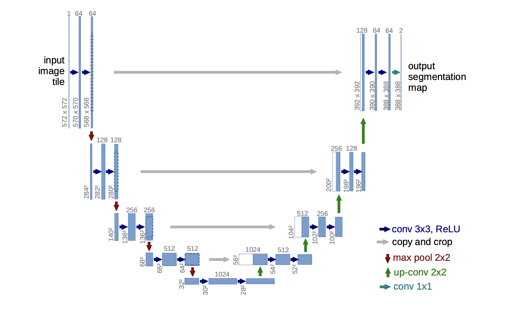

## U-Net Implementation With PyTorch

<div align="center">
    <a href="">
        
    </a>
</div>
<br/>
<div align="center">
    <p>Liked our work? give us a ⭐!</p>
</div>

<p align="center">
  
</p>

This repository contains minimalistic implementation of U-Net that is introduced in the paper [U-Net: Convolutional Networks for Biomedical Image Segmentation](https://arxiv.org/abs/1505.04597) using PyTorch. Implementation has tested using [Carvana Image Masking Challenge](https://www.kaggle.com/c/carvana-image-masking-challenge) by Kaggle.

### YouTube Tutorial
This repository also contains a corresponding YouTube tutorial with the title **Implement and Train U-NET From Scratch for Image Segmentation - PyTorch**

[](https://www.youtube.com/watch?v=HS3Q_90hnDg&t=10s)

## Table of Contents
* [U-Net Implementation](#vitimp)
    * [UNet](#unet)
    * [DoubleConv](#doubleconv)
    * [DownSample](#down)
    * [UpSample](#up)
* [Usage](#usage)
* [Contact](#contact)

## U-Net Implementation <a class="anchor" id="imp"></a>
We need four classes to implement U-Net. Parts of the `UNet` class which are `DownSample` to apply down sampling operation, `UpSample` to apply up sampling operation, `DoubleConv` to apply double convolution operation and the `UNet` as the main U-Net class.

### UNet <a class="anchor" id="unet"></a>

```
class UNet(nn.Module):
    def __init__(self, in_channels, num_classes):
        super().__init__()
        self.down_convolution_1 = DownSample(in_channels, 64)
        self.down_convolution_2 = DownSample(64, 128)
        self.down_convolution_3 = DownSample(128, 256)
        self.down_convolution_4 = DownSample(256, 512)

        self.bottle_neck = DoubleConv(512, 1024)

        self.up_convolution_1 = UpSample(1024, 512)
        self.up_convolution_2 = UpSample(512, 256)
        self.up_convolution_3 = UpSample(256, 128)
        self.up_convolution_4 = UpSample(128, 64)

        self.out = nn.Conv2d(in_channels=64, out_channels=num_classes, kernel_size=1)

    def forward(self, x):
       down_1, p1 = self.down_convolution_1(x)
       down_2, p2 = self.down_convolution_2(p1)
       down_3, p3 = self.down_convolution_3(p2)
       down_4, p4 = self.down_convolution_4(p3)

       b = self.bottle_neck(p4)

       up_1 = self.up_convolution_1(b, down_4)
       up_2 = self.up_convolution_2(up_1, down_3)
       up_3 = self.up_convolution_3(up_2, down_2)
       up_4 = self.up_convolution_4(up_3, down_1)

       out = self.out(up_4)
       return out
```

### DoubleConv <a class="anchor" id="doubleconv"></a>

```
class DoubleConv(nn.Module):
    def __init__(self, in_channels, out_channels):
        super().__init__()
        self.conv_op = nn.Sequential(
            nn.Conv2d(in_channels, out_channels, kernel_size=3, padding=1),
            nn.ReLU(inplace=True),
            nn.Conv2d(out_channels, out_channels, kernel_size=3, padding=1),
            nn.ReLU(inplace=True)
        )

    def forward(self, x):
        return self.conv_op(x)
```

### DownSample <a class="anchor" id="down"></a>

```
class DownSample(nn.Module):
    def __init__(self, in_channels, out_channels):
        super().__init__()
        self.conv = DoubleConv(in_channels, out_channels)
        self.pool = nn.MaxPool2d(kernel_size=2, stride=2)

    def forward(self, x):
        down = self.conv(x)
        p = self.pool(down)

        return down, p
```

### UpSample <a class="anchor" id="up"></a>
```
class UpSample(nn.Module):
    def __init__(self, in_channels, out_channels):
        super().__init__()
        self.up = nn.ConvTranspose2d(in_channels, in_channels//2, kernel_size=2, stride=2)
        self.conv = DoubleConv(in_channels, out_channels)

    def forward(self, x1, x2):
       x1 = self.up(x1)
       x = torch.cat([x1, x2], 1)
       return self.conv(x)
```

## Usage <a class="anchor" id="usage"></a>

### Project Structure <a class="anchor" id="ps"></a>
Project structured as follows:

```
.
└── src/
    ├── carvana_dataset.py
    ├── unet.py
    ├── unet_parts.py
    ├── main.py
    ├── inference.py
    ├── data/
    │   ├── manual_test
    │   ├── manual_test_mask
    │   ├── train
    │   └── train_mask
    └── models/
```

`carvana_dataset.py` creates the PyTorch dataset. `unet_parts.py` contains the building blocks for the U-Net. `unet.py` is the file that contains the U-Net architecture. `main.py` file contains the training loop. `inference.py` contains necessary functions to easly run inference for single and multiple images.

`models/` directory is to save and store the trained models.

`data/` directory contains the data you're going to train on. `train/` contains images and `train_mask/` contains masks for the images. `manual_test/` and `manual_test_mask/` are optional directories for showcasing the inference.

### Pre-Trained Model <a class="anchor" id="ptm"></a>
You can download a sample pre-trained model from [here](https://drive.google.com/file/d/1evei4cZkBlpoq70iapItN1ojldIXSOc2/view?usp=sharing). Put the model into the `models/` directory.

### Inference <a class="anchor" id="inference"></a>
`inference.py` file provides two functions for inference. If you want to run prediction on multiple images, you must use `pred_show_image_grid()` function by giving your data path, model path and device as arguments.

If you want to run the prediction on single image, you must use `single-image-inference()` function by giving image path, model path and your device as arguments. 

You can view a sample use inside `inference.py`.

### Training <a class="anchor" id="training"></a>
In order to train the model you must run the command `python main.py`. File has hyperparameters of `LEARNING_RATE`, `BATCH_SIZE` and `EPOCHS`. You can change them as you like.

You must give your data directory and the directory you want to save your model to `DATA_PATH` and `MODEL_SAVE_PATH` variables in the `main.py` file.

By the end of the training your model will be saved into the `MODEL_SAVE_PATH`.

## Contact <a class="anchor" id="contact"></a>
You can contact me with this email address: uygarsci@gmail.com
