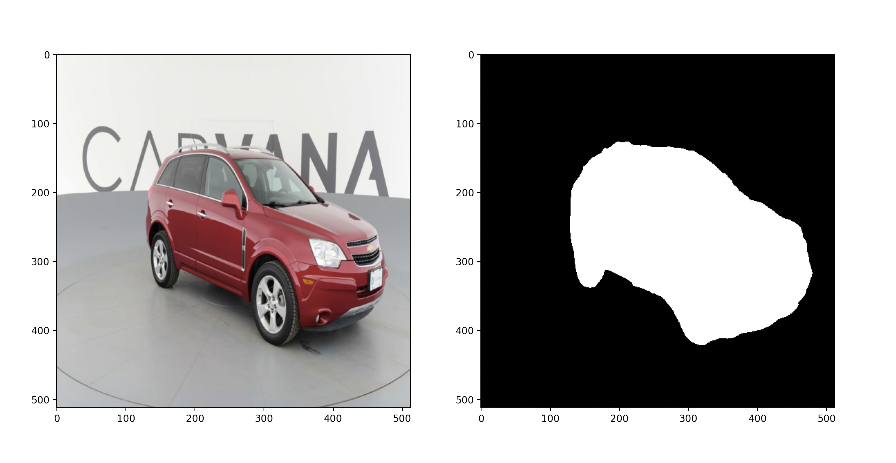

## Minimalistic U-Net Implementation With PyTorch

This repository contains minimalistic implementation of U-Net using PyTorch. Implementation has tested using [Carvana Image Masking Challenge](https://www.kaggle.com/c/carvana-image-masking-challenge) by Kaggle.

### YouTube Tutorial
This repository also contains a corresponding YouTube tutorial.

