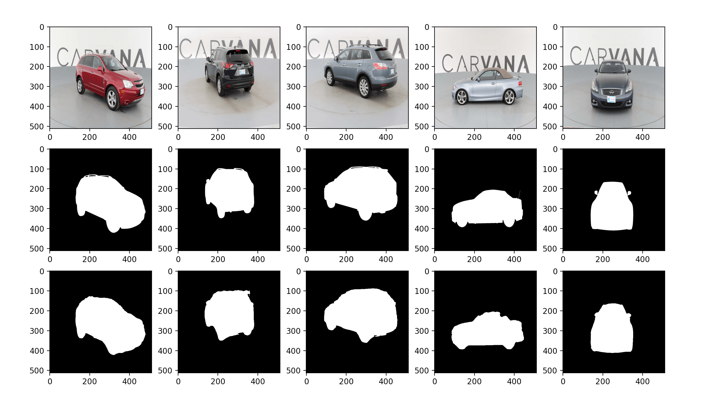

## Minimalistic U-Net Implementation With PyTorch



This repository contains minimalistic implementation of U-Net using PyTorch. Implementation has tested using [Carvana Image Masking Challenge](https://www.kaggle.com/c/carvana-image-masking-challenge) by Kaggle.

Above example demonstrates original images, original masks and predicted masks row by row.

### YouTube Tutorial
This repository also contains a corresponding YouTube tutorial with the title **Implement and Train U-NET From Scratch for Image Segmentation - PyTorch**

[](https://www.youtube.com/watch?v=HS3Q_90hnDg&t=10s)

### Inference
`inference.py` file provides two functions for inference. If you want to run prediction on multiple images, you must use `pred_show_image_grid()` function by giving your data path, model path and device as arguments.

If you want to run the prediction on single image, you must use `single-image-inference()` function by giving image path, model path and your device as arguments. 

You can view a sample use inside `inference.py`.

### Training
In order to train the model you must run the command `python main.py`. File has hyperparameters of `LEARNING_RATE`, `BATCH_SIZE` and `EPOCHS`. You can change them as you like.

You must give your data directory and the directory you want to save your model to `DATA_PATH` and `MODEL_SAVE_PATH` variables in the `main.py` file.

By the end of the training your model will be saved into the `MODEL_SAVE_PATH`.

### Dataset Structure
By default the data folder structured like this:

```
.
└── data/
    ├── manual_test
    ├── manual_test_mask
    ├── train
    └── train_mask
```
`train` contains images and `train_mask` contains masks for the images. `manual_test` and `manual_test_mask` are optional directories for showcasing the inference.
